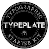
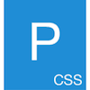
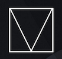

## Boilerplates and helpers

 

A great starting point for a new web page is the [HTML5 Boilerplate](https://html5boilerplate.com/). Take some time to look through [the documentation](https://github.com/h5bp/html5-boilerplate/blob/5.3.0/dist/doc/TOC.md): every decision has solid reasoning behind, which they explain in detail.

A good CSS baseline to start from is [Normalise](https://necolas.github.io/normalize.css/). It gives you more consistent rendering across a variety of browsers without resetting everything to zero. If you're particularly interested in typography, have a look at [TypePlate](http://typeplate.com/).

## Grid systems

If you just want some help putting together a solid grid, you can use [Gridly](http://ionicabizau.github.io/gridly/example/), a minimal grid system.

If you use [Sass](http://sass-lang.com/), [Susy](http://susy.oddbird.net/) is very handy. It's a set of tools for creating powerful custom grid layouts.

## Small frameworks

   

[Milligram](http://milligram.github.io/) is a minimalist CSS framework. It's very light, but has few features. [Skeleton](http://getskeleton.com/) A dead simple, responsive boilerplate.

If you want something with a bit more, try [Bulma](http://bulma.io/) (has more character) or [Furtive](http://furtive.co/) (more opinionated, designed more as a starting point).

If you want to pick and choose what things you're going to use, checl out [Pure](http://purecss.io/). It's a set of small, responsive CSS modules.

If you need some JavaScript, check out [MicroJS](http://microjs.com/) and [You Might Not Need jQuery](http://youmightnotneedjquery.com/).

## Preprocessor mixin libraries

  

If you are using a preprocessor there are a couple of mixin libraries that could be useful.

* [Bourbon](http://bourbon.io/) is a library of Sass mixins for things like vendor prefixes, typographic scale, animation. Pairs well with [Bourbon Neat for grids](http://neat.bourbon.io/).
* [Bitters](http://bitters.bourbon.io/) provides scaffolding for Bourbon projects, and [Refills](http://refills.bourbon.io/) helps build components and patterns for Bourbon and Neat projects.
* [Rucksack](http://simplaio.github.io/rucksack/)
* [Concise](http://concisecss.com/)

## Starter Kits / Boilerplates

[Google's Web Start Kit](https://developers.google.com/web/tools/starter-kit/) is full of modern front-end best practices, but makes a lot of assumptions: gulp, sass, concatenation and minification of CSS, concatenation and minification of JS, babel, browsersync, PageSpeed, Service Workers, npm.

## Full-on frameworks

   

If you do decide to use a big, off-the-shelf, Front-end framework, you use them by adding the appropriate `<link>` for the CSS at the top, and `<script>` for the JS at the bottom your HTML pages.

Twitter's [Bootstrap](http://getbootstrap.com/) is one of the most widely known and widely used HTML, CSS, and JS frameworks. It's easiest to use all of Bootstrap, not pieces of it. When you try and use pieces, or try and add extra bits to it, things get tricky. It can be a bit heavy, depending on your needs.

The other famous one is [Zurb's Foundation](http://foundation.zurb.com/). It has pretty much the same ups and down as Bootstrap.

Both of these are great for doing prototypes: they let you put things together very quickly. They're not necessarily the best choice for your final application, though.

An alternative to those two big hitters is [Materialize](http://materializecss.com/). A lighter alternative to that is [Material Design Lite](http://www.getmdl.io/). Both frameworks are based on [Google's Material Design](https://www.google.com/design/spec/material-design/introduction.html). Like Bootstrap and Foundation, they're quite opinionated about the visual design, and trying to stray from that will be difficult.
